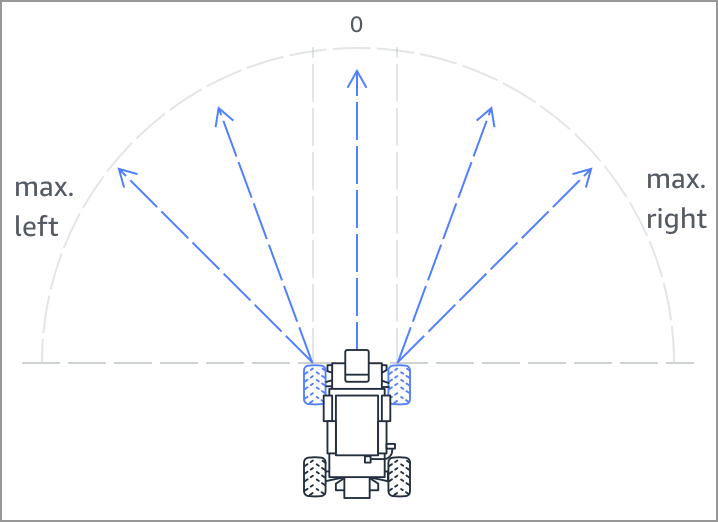

# AWS DeepRacer Reward Function
AWS DeepRacer reward function

The function will achieve 15 sec lap time (Note: record thus far has been 7.8sec)

## Action Space

| Action No# | Steering     | Speed   |
|------------|--------------|---------|
| 0          |  -30 degrees | 2.5 m/s |
| 1          |  -30 degrees |   5 m/s |
| 2          |  -20 degrees | 2.5 m/s |
| 3          |  -20 degrees |   5 m/s |
| 4          |  -10 degrees | 2.5 m/s |
| 5          |  -10 degrees |   5 m/s |
| 6          |    0 degrees | 2.5 m/s |
| 7          |    0 degrees |   5 m/s |
| 8          |   10 degrees | 2.5 m/s |
| 9          |   10 degrees |   5 m/s |
| 10         |   20 degrees | 2.5 m/s |
| 11         |   20 degrees |   5 m/s |
| 12         |   30 degrees | 2.5 m/s |
| 13         |   30 degrees |   5 m/s |

## Hyperparameter Values

| Hyperparameter                                                 | Value |
|----------------------------------------------------------------|-------|
| Gradient Descent Batch Size                                    | 64    |
| Entropy                                                        | 0.01  |
| Discount Factor                                                | 0.999 |
| Loss Type                                                      | Huber |
| Learning Rate                                                  | 0.0003|
| No# Experience Episodes between each policy-updating iteration | 20    |
| No# of Epochs                                                  | 10    |

## Shout Outs

AWS DeepRacer Team
